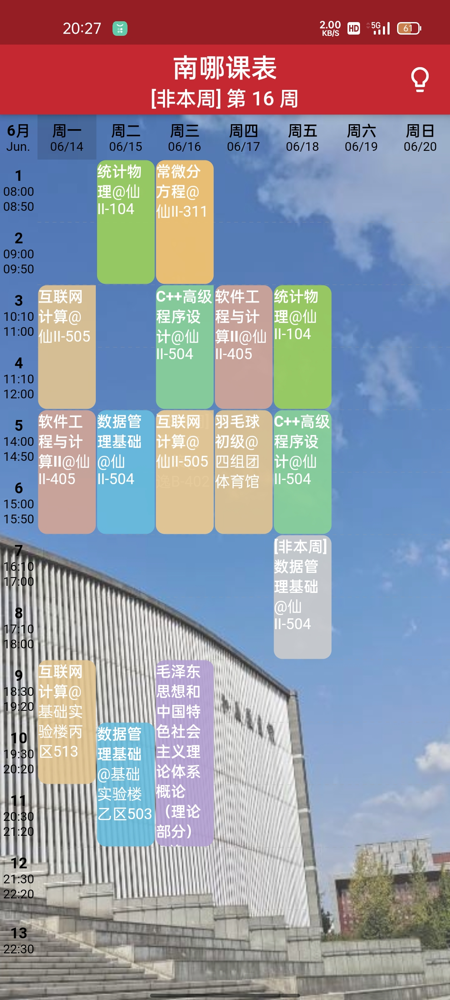
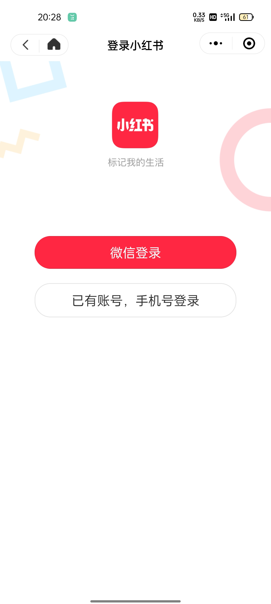
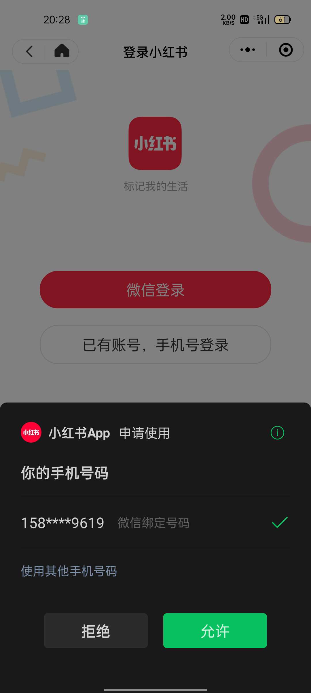
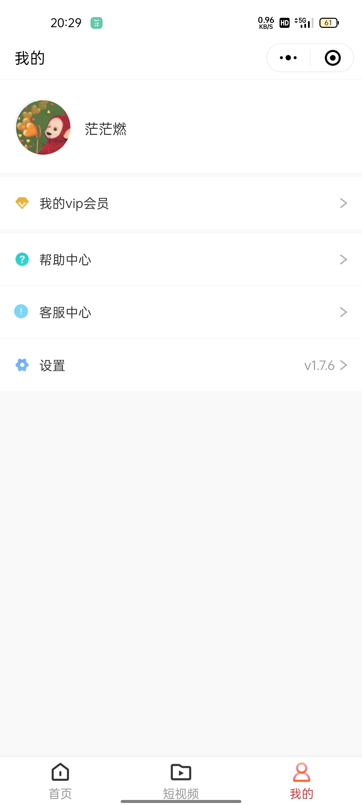
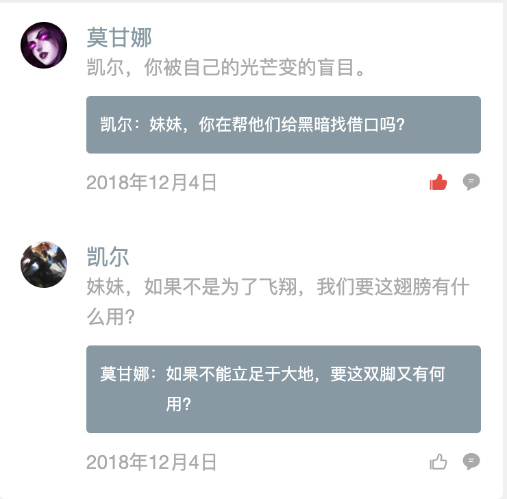

## 预约

### 功能

#### 学生端

使用标签：安排自己的谈话时间

每一个标签支持：

1. 点击：

   >1. 若是第一次点击，则弹出模态框，用来输入谈话主题，其他要求，指定老师（2.0），选择谈话地点
   >2. 之后点击，则用来展示，同时提供修改以上内容的功能

2. 长按：确认、删除日程

   >1. 长按标签：底部弹出“确认、删除”两个按钮，同时该标签支持拖动
   >2. 长按空白：新增标签

   ==点击确认按钮==：向对应的老师微信发送通知

   

3. 长按后拖动：修改日程时间长度

   >1. 拖动标签来修改预约时长

标签内容：

1. 谈话时间
2. 谈话地点
3. 谈话老师（2.0）
4. 主题
5. 其他要求

#### 教师端

使用标签：

1. 指定某一个学生的谈话
2. 填写自己的时间安排

每一个标签支持：

和学生端大致相同

点击标签后，模态框要支持“选择标签类型”：自己的日程安排or指定学生谈话

==点击确认按钮==：向对应的学生微信发送通知

标签内容：

1. 谈话时间
2. 谈话地点
3. 谈话学生
4. 主题
5. 其他要求

## 我的

### 登陆前

### 登陆时

### 登陆后

使用微信原生昵称和头像即可

### 教师端

1. 实名认证
2. 我的班级（2.0）
3. 我的预约
4. 设置->退出登录

### 学生端

1. 实名认证
2. 加入班级（2.0）
3. 我的预约
4. 设置->退出登录

## 组件or样式

### 1.预约条

响应式布局

### 2.预约卡片

